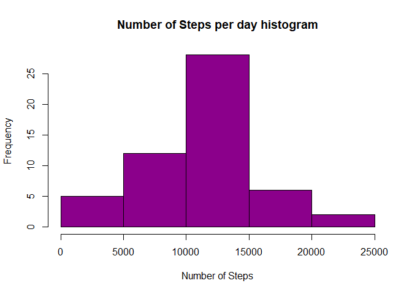
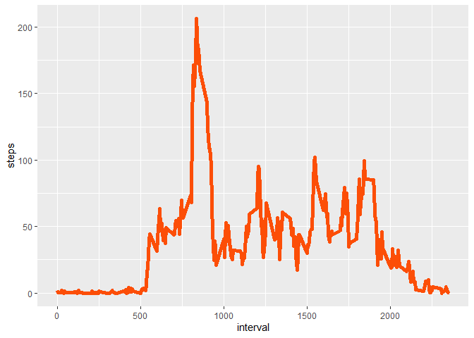
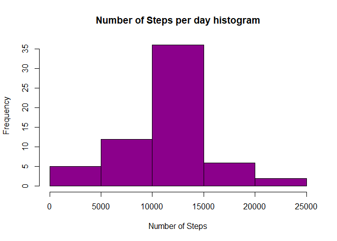
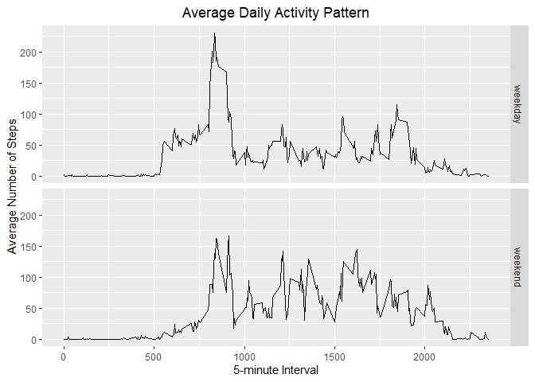

## Loading and preprocessing the data


```r
data <- read.table(unz("activity.zip", "activity.csv"), header=T, quote="\"", sep=",")
```


## What is mean total number of steps taken per day?

```r
totalsteps <- aggregate(steps ~ date, data, sum)
hist(totalsteps$steps,
     main="Number of Steps per day histogram",
xlab="Number of Steps",
col="darkmagenta")
```

<!-- -->

```r
meansteps <- mean(totalsteps$steps)
sprintf("mean number of steps is %f", meansteps)
```

```
## [1] "mean number of steps is 10766.188679"
```

```r
mediansteps <- median(totalsteps$steps)
sprintf("median number of steps is %f", mediansteps)
```

```
## [1] "median number of steps is 10765.000000"
```

## What is the average daily activity pattern?

```r
library(ggplot2)
stepsdata <- aggregate(steps ~ interval, data, mean)
ggplot(data = stepsdata, aes(x = interval, y = steps)) + 
  geom_line(color = "#FC4E07", size = 2)
```

<!-- -->

```r
maxinterval <- stepsdata[which.max(stepsdata$steps),]
sprintf("interval with max number of steps is %f",maxinterval[,1] )
```

```
## [1] "interval with max number of steps is 835.000000"
```


## Imputing missing values

```r
missingdata <- is.na(data$steps)
length(missingdata)
```

```
## [1] 17568
```

```r
newdata <- transform(data, steps = ifelse(is.na(data$steps), stepsdata$steps[match(data$interval, stepsdata$interval)], data$steps))


totalsteps <- aggregate(steps ~ date, newdata, sum)
hist(totalsteps$steps,
     main="Number of Steps per day histogram",
xlab="Number of Steps",
col="darkmagenta")
```

<!-- -->

```r
impmeansteps <- mean(totalsteps$steps)
sprintf("mean number of steps is %f", impmeansteps)
```

```
## [1] "mean number of steps is 10766.188679"
```

```r
impmediansteps <- median(totalsteps$steps)
sprintf("median number of steps is %f", impmediansteps)
```

```
## [1] "median number of steps is 10766.188679"
```

```r
diffmean <- impmeansteps - meansteps
sprintf("difference between means before and after impute %f", diffmean)
```

```
## [1] "difference between means before and after impute 0.000000"
```

```r
diffmedian <- impmediansteps - mediansteps
sprintf("difference between medians before and after impute %f", diffmedian)
```

```
## [1] "difference between medians before and after impute 1.188679"
```

## Are there differences in activity patterns between weekdays and weekends?

```r
library(lubridate)
```

```
## 
## Attaching package: 'lubridate'
```

```
## The following objects are masked from 'package:base':
## 
##     date, intersect, setdiff, union
```

```r
newdata <- transform(newdata, daynum = wday(newdata$date))
newdata <- transform(newdata, daytype = ifelse(newdata$daynum == 1 | newdata$daynum == 7, 'weekend', 'weekday'))


stepsdata <- aggregate(steps ~ interval + daytype, newdata, mean)
ggplot(data = stepsdata, aes(x = interval, y = steps)) + 
  geom_line() +
  facet_grid(daytype ~ .) +
  ggtitle("Average Daily Activity Pattern") +
  xlab("5-minute Interval") +
  ylab("Average Number of Steps") +
  theme(plot.title = element_text(hjust = 0.5))
```

<!-- -->
